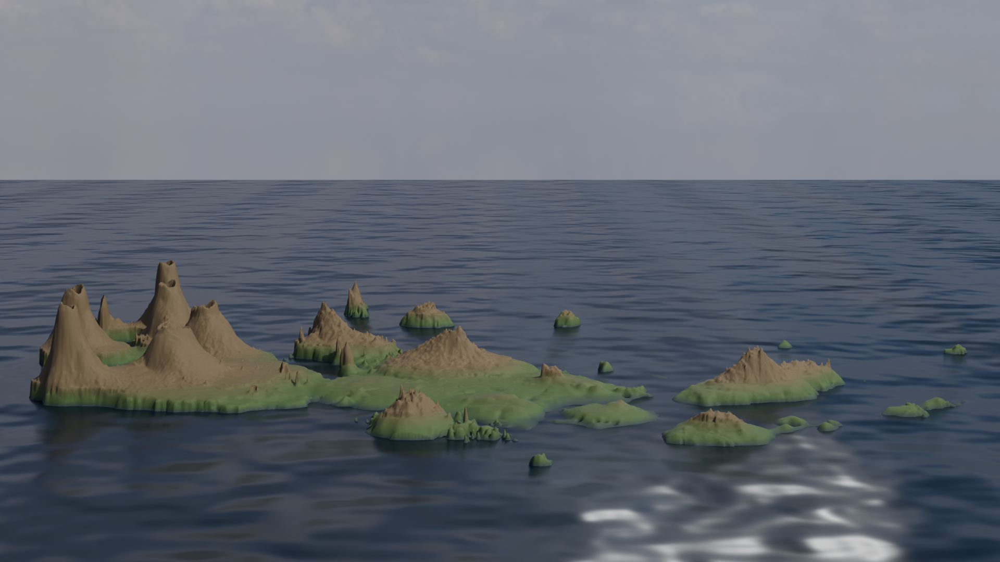
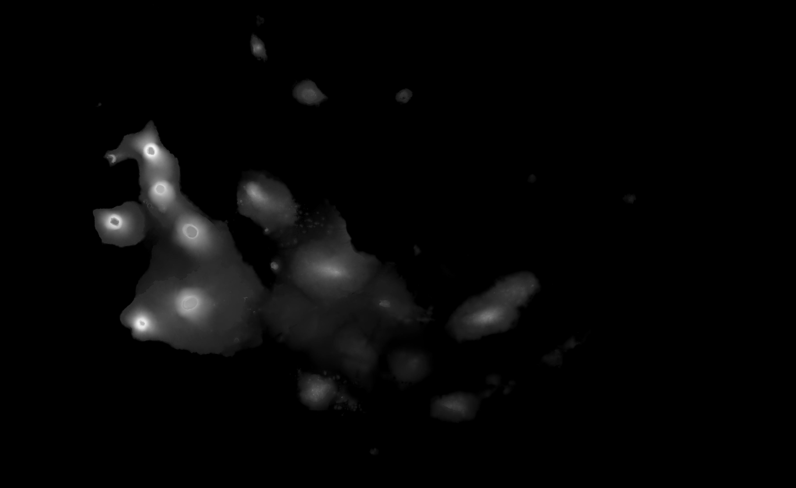
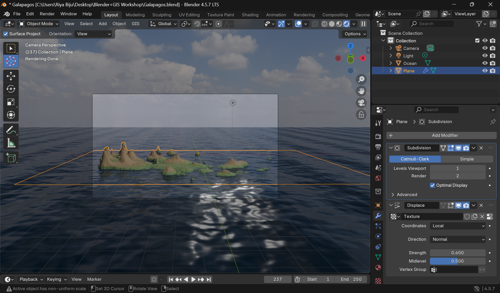
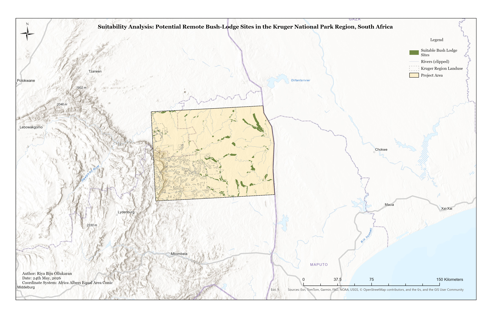

<!-- Core Portfolio Styling -->

  <!-- HERO HEADER SECTION -->
  <header style="text-align: center; padding: 40px 0 20px 0; margin-bottom: 40px;">
    <h1 style="font-size: 3rem; font-weight: 800; color: var(--dark-slate); margin-bottom: 5px; letter-spacing: -0.03em;">Riya Biju Ollukaran</h1>
    
Spatial Data Scientist & 3D Environment Specialist

    
    

      Final-Year Master of Data Science student at Monash University. Fusing Data Science with geospatial mechanics (ArcGIS, QGIS, Blender) to translate spatial telemetry into high-fidelity environments.
    

    

      📍 Melbourne, Australia | ✉️ riyabijuollukaran@gmail.com | 🔗 <a href="https://www.linkedin.com/in/riya-biju-ollukaran/" target="_blank" style="color: var(--primary-blue); text-decoration: none; font-weight: 600;">LinkedIn</a>
    

  </header>

  <!-- BANNER MEDIA CONTAINER -->
  

    <video width="100%" autoplay loop muted playsinline style="display: block;">
      <source src="assets/video/GIS Personal LinkedIn Banner.mp4" type="video/mp4">
      Your browser does not support the video tag.
    </video>
  

  <!-- SECTION I: GEOSPATIAL & 3D TOPOGRAPHIC MODELING -->
  <h2 class="section-title" style="color: var(--primary-blue); border-color: var(--primary-blue);">I. Geospatial Analysis & 3D Topographic Modeling</h2>

  <!-- PROJECT 1: Galapagos 3D Modeling (Digital Twin Frame) -->
  <article class="grid-card">
    

      [High Complexity] Digital Twin Prototype
      <h3 style="font-size: 1.8rem; margin: 5px 0 10px 0; color: var(--dark-slate);">3D Geospatial Visualization: Galapagos Archipelago Case Study</h3>
      
The School of Information Design | Under Instruction of Elizabeth Rosenbloom

      
      

        <strong style="display: block; font-size: 0.75rem; color: #64748b; margin-bottom: 5px; text-transform: uppercase;">Data Pipeline Architecture:</strong>
        

          Raw Raster DEM ➔ Coordinate Alignment (WGS 84 / EPSG:4326) ➔ Mesh Extrusion (Blender Modifiers) ➔ Procedural Node Displacement Shading
        

      

      <ul style="padding-left: 20px; color: var(--body-gray);">
        <li style="margin-bottom: 8px;"><strong>Pipeline Engineering:</strong> Built an uncompressed, non-destructive spatial asset extraction process to translate raw GIS elevation models directly into structural render meshes.</li>
        <li style="margin-bottom: 8px;"><strong>Topographical Alignment:</strong> Resolved systemic software unit-mismatches by re-projecting base source layers to ensure geographic coordinate accuracy.</li>
        <li style="margin-bottom: 8px;"><strong>Procedural Node Development:</strong> Engineered complex, object-space procedural shader nodes within Blender to accurately model micro-wave pattern distributions across deep water interfaces.</li>
      </ul>

      

        QGIS
        Blender 3D
        DEM Modeling
        WGS 84
      

    

    
    

      
      

        
        
      

    

  </article>

  <!-- PROJECT 2: South Africa Bush Lodges MCE -->
  <article class="grid-card reverse">
    

      
    

    
    

      [Medium Complexity] Land Suitability Analysis
      <h3 style="font-size: 1.8rem; margin: 5px 0 10px 0; color: var(--dark-slate);">Suitable Sites for Remote Bush Lodges in Northeastern South Africa</h3>
      
Monash University | EAE5258 – GIS for Environmental Sciences

      
      

        <strong style="display: block; font-size: 0.75rem; color: #64748b; margin-bottom: 5px; text-transform: uppercase;">Data Pipeline Architecture:</strong>
        

          7 Vector/Raster Inputs ➔ Africa Albers Equal Area Projection ➔ Topo to Raster DEM Integration ➔ Multi-Criteria Reclassification ➔ Boolean Overlay
        

      

      <ul style="padding-left: 20px; color: var(--body-gray);">
        <li style="margin-bottom: 8px;"><strong>Multi-Criteria Evaluation (MCE):</strong> Standardized 7 separate datasets by resolving structural vector defects and coordinate shifts across administrative maps.</li>
        <li style="margin-bottom: 8px;"><strong>Terrain Derivation:</strong> Extracted continuous slope gradients and directional aspect configurations using spatial mathematical matrices from contours.</li>
        <li style="margin-bottom: 8px;"><strong>Environmental Filtering:</strong> Executed raster calculator logic loops and mathematical constraints, identifying 263 low-impact environmental candidate locations across the Kruger National Park layout.</li>
      </ul>

      

        ArcGIS Pro
        Spatial Analyst
        MCE Matrix
      

    

  </article>

  <!-- PROJECT 3: San Francisco Greenspace Analysis -->
  <article class="grid-card">
    

      [Low/Med Complexity] Urban Analytics Matrix
      <h3 style="font-size: 1.8rem; margin: 5px 0 10px 0; color: var(--dark-slate);">San Francisco Mapping: Urban Green Spaces Project Evaluation</h3>
      
Independent Geospatial Certification Focus

      
      

        An urban assessment model checking local public park accessibility thresholds and density distribution spreads across metropolitan San Francisco boundaries. Evaluated infrastructural park access by matching regional civic vectors against community boundaries.
      

      <ul style="padding-left: 20px; color: var(--body-gray);">
        <li style="margin-bottom: 8px;">Analyzed neighborhood location access variances by configuring demographic distribution buffers against spatial polygon layouts.</li>
        <li style="margin-bottom: 8px;">Generated spatial scores shown explicitly inside the formal map artifact titled <strong>SF Parks Evaluation.jpg</strong>.</li>
      </ul>

      

        ArcGIS
        Urban Networks
        <a href="https://coursera.org/share/444f44ed46f7be52f5736cf9c1595938" target="_blank" style="margin-left: 10px; font-size: 0.85rem; color: var(--primary-blue); font-weight: 700; text-decoration: none;">Verify Credential ↗</a>
      

    

    
    

      
    

  </article>

  <!-- SECTION II: DATA SCIENCE FRAMEWORKS & SPATIOTEMPORAL DASHBOARDS -->
  <h2 class="section-title" style="color: var(--primary-green); border-color: var(--primary-green);">II. Data Science & Narrative Dashboards</h2>

  

    
    <!-- PROJECT 4: AI Outbreak Spotting (Data Science Module) -->
    <article style="background: #ffffff; border: 1px solid var(--border-gray); border-radius: 16px; padding: 30px; box-shadow: 0 4px 6px -1px rgba(0,0,0,0.02); display: flex; flex-direction: column; justify-content: space-between;">
      

        

          <h3 style="margin: 0; font-size: 1.4rem; color: var(--dark-slate);">AI-Powered Pandemic Early Detection System</h3>
          Monash University
        

        

          Engineered an analytics architecture model utilizing multi-stream inputs (wastewater, mobility logs, historical patterns) to pinpoint initial public health anomalies. 
        

        <ul style="padding-left: 20px; font-size: 0.9rem; color: var(--body-gray);">
          <li style="margin-bottom: 6px;">Evaluated deep historical CDC FluView tracking layers using R frameworks (`dplyr`, `ggplot2`).</li>
          <li style="margin-bottom: 6px;">Achieved an ~80% analytical sensitivity metric across early anomaly signal variations, earning academic Distinction.</li>
        </ul>
      

      
      

        R Core
        Time-Series
        Predictive Modeling
      

    </article>

    <!-- PROJECT 5: Arctic Circle Change (Spatiotemporal Track) -->
    <article style="background: var(--dark-slate); color: #ffffff; border-radius: 16px; padding: 30px; display: flex; flex-direction: column; justify-content: space-between; border-top: 4px solid var(--primary-green);">
      

        

          <h3 style="margin: 0; font-size: 1.4rem; color: #ffffff;">Arctic Circle Environmental Change Visualizer</h3>
          ONGOING DEVELOPER PIPELINE
        

        
Monash University | FIT5147 – Data Visualization Focus

        
        

          Designing an interactive narrative visualization application engine to explore the overlapping environmental impacts of systemic polar shifts.
        

        <ul style="padding-left: 20px; font-size: 0.9rem; color: #cbd5e1;">
          <li style="margin-bottom: 6px;">Consolidating long-term spatio-temporal logs tracking sea ice anomalies (1978–2026) alongside satellite GPS coordinates.</li>
          <li style="margin-bottom: 6px;">Integrating synchronized dashboards deploying active Leaflet mapping frameworks to capture how resource tracking overlaps commercial shipping channels.</li>
        </ul>
      

      

        R Shiny
        Leaflet Spatial
        Spatiotemporal Modeling
      

    </article>

  

  <!-- RESTRUCTURED CORE METADATA SECTIONS -->
  

    
    <!-- SKILLS MATRIX -->
    <section style="background: #ffffff; border: 1px solid var(--border-gray); padding: 25px; border-radius: 12px;">
      <h4 style="margin-top: 0; color: var(--dark-slate); font-size: 1.2rem; border-left: 4px solid var(--primary-blue); padding-left: 10px;">Technical Stack Matrix</h4>
      <ul style="padding-left: 20px; color: var(--body-gray); font-size: 0.95rem;">
        <li style="margin-bottom: 6px;"><strong>Spatial & Analytics:</strong> ArcGIS, ArcGIS Pro, QGIS, Blender 3D (Cycles Engine), Spatial Analyst toolkit frameworks</li>
        <li style="margin-bottom: 6px;"><strong>Data Ecosystems:</strong> Python (Pandas, Scikit-Learn), R (Dplyr, Ggplot2), Oracle SQL Developer Database structures</li>
        <li style="margin-bottom: 6px;"><strong>Operational Tools:</strong> Version Control (GitLab, Git pipeline structures), Jira Management, Excel</li>
      </ul>
    </section>

    <!-- EDUCATION & CERTIFICATIONS -->
    <section style="background: #ffffff; border: 1px solid var(--border-gray); padding: 25px; border-radius: 12px;">
      <h4 style="margin-top: 0; color: var(--dark-slate); font-size: 1.2rem; border-left: 4px solid var(--primary-green); padding-left: 10px;">Education & Foundations</h4>
      
<strong>Master of Data Science</strong> – Monash University (Final Year candidate)

      
<strong>Bachelor of Economics (Statistics Minor)</strong> – St. Xavier’s College [GPA: 7.83/10]

      
      Active Certifications:
      

        • ArcGIS for Beginners: Mapping Urban Green Spaces (Coursera, 2026) 
        • Python Data Analysis Masterclass (2024) | Python Data Visualization Foundations (2020)
      

    </section>

  

  <!-- FOOTER STAMP -->
  <footer style="text-align: center; margin-top: 60px; padding-top: 20px; border-top: 1px solid var(--border-gray); color: #94a3b8; font-size: 0.85rem;">
    Portfolio Pipeline Architecture & Metadata Assets Verified • Compiled June 2026
  </footer>

